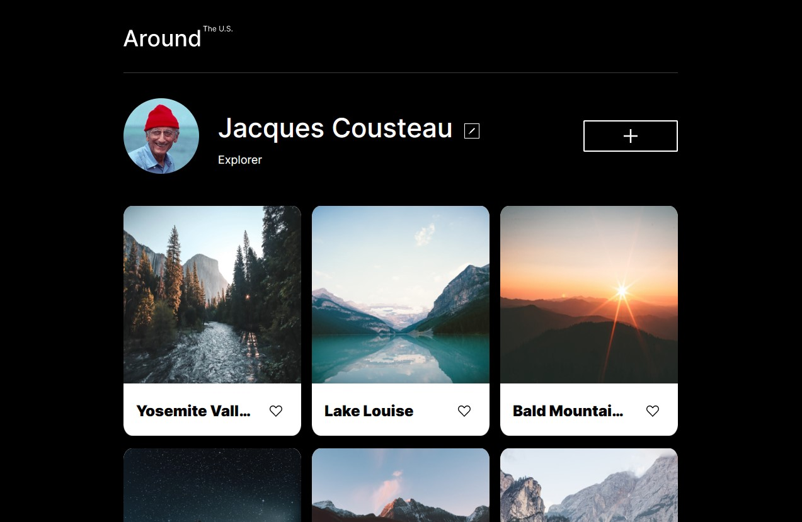
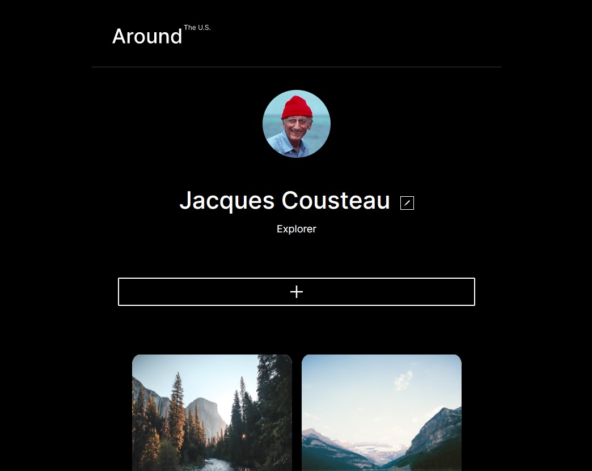
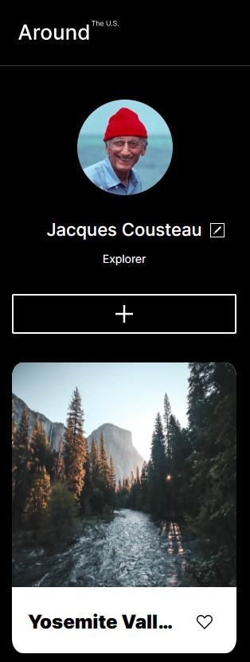

# Project 3: Around The U.S.

### Overview: Project Features

- HTML
- CSS
- Flex-Box
- Grid
- Media Queries
- Figma

**Intro**

This project is made so all the elements are displayed correctly on popular screen sizes. This responsive design is made possible by combining grid, flex-box and media queries.

**Links**

- [Link to webpage](https://ricardovegajr.github.io/se_project_aroundtheus/)

- [Link to the project on Figma](https://www.figma.com/file/ii4xxsJ0ghevUOcssTlHZv/Sprint-3%3A-Around-the-US?node-id=0%3A1)

**Images**

Photos used in project optimized on [here](https://tinypng.com/), to speed up webpage load times.

**Webpage on different sizes**

1280px 
1050px 
320px 

Thank you !
